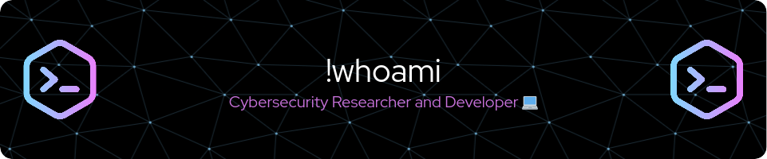

 
I am passionate about cybersecurity with a primary focus on protecting and securing digital systems. I am always learning about cybersecurity threats to ensure the security of systems.  
In addition to my passion for cybersecurity, I have experience in web and mobile application development.  
My goal is to use my cybersecurity and development skills to create a safer digital environment and protect users' information and privacy.

<h3 align="center">Social Networks</h3>

 &nbsp;  

| <h4 align="center"> 🖥️  My portfolio at </h4> | <h4 align="center"> ✉️ Contact me at </h4> |  
| :---: | :---: |
|  |  | 

 
 
  

 
<picture>
  <source media="(prefers-color-scheme: dark)" srcset="https://raw.githubusercontent.com/platane/platane/output/github-contribution-grid-snake-dark.svg">
  <source media="(prefers-color-scheme: light)" srcset="https://raw.githubusercontent.com/platane/platane/output/github-contribution-grid-snake.svg">
  
</picture>

 

<h3 align="center">SKILLS</h3>

| <h4 align="center">💻  BACKEND</h4> | <h4 align="center">💻  FRONTEND</h4>| <h4 align="center">💻  DATA BASE</h4>
| :---: | :---: | :---: |
|   |    |    
| <h4 align="center">💻  SCRIPTING</h4>  | <h4 align="center">💻  EDITORS </h4> | <h4 align="center">💻 SO </h4> |
|   |   |        |

 
 

